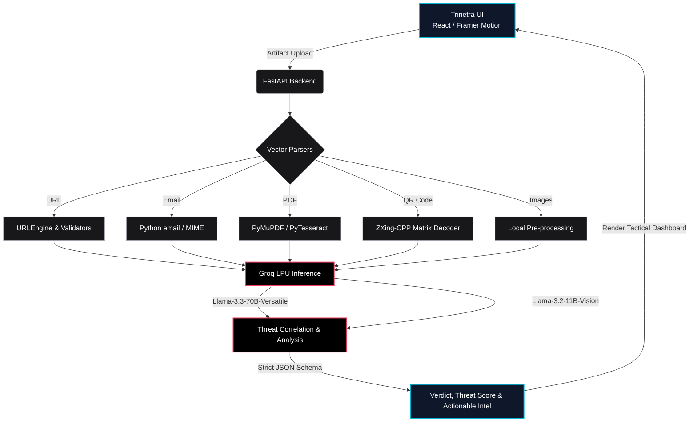

# TRINETRA

**Author**: Prasad Prashant Dabhekar (B.E. Information Technology)

## Project Overview
TRINETRA is an AI-powered digital artifact forensics platform designed to aid security analysts in inspecting and dissecting suspicious digital payloads. The system focuses on localized extraction and parsing of artifacts to minimize data exposure and API payload sizes before transmitting structured indicators to large language models for threat reasoning. 

## Core Architecture
The platform utilizes a decoupled client-server architecture:
- **Frontend Client**: Built with React and Tailwind CSS. It implements an asynchronous state-machine UI for robust file staging, upload handling, and threat report rendering. 
- **Backend Service**: Built on FastAPI. The backend orchestrates deterministic data extraction using Python-based forensic libraries before querying the AI engine. Local parsing ensures that large binary streams and non-actionable data are stripped out prior to LLM inference.
- **AI Engine**: Utilizes the Groq API for rapid inference. Text and JSON data are analyzed by Llama-3.3-70b-versatile, while vision tasks and image fallback decoding are processed by Llama-3.2-11b-vision-preview and Qwen 3.6 27B.

## System Architecture

When digital artifact payloads are uploaded via the React frontend, the FastAPI server immediately directs them to specialized Python engines that perform localized deterministic parsing and preprocessing. Once the raw noise is stripped away, cleanly structured indicators and text streams are securely routed into Groq's Llama-3 inference models to evaluate threat metrics and return a standardized JSON verdict.


## Key Features
- **URL Analysis**: Extracts domains, parameters, and redirects for threat evaluation.
- **Email Forensics**: Parses `.eml` files to extract routing headers, SPF/DKIM data, embedded URLs, and attachments.
- **PDF Scanning**: Analyzes PDF streams using PyMuPDF (`fitz`) to extract embedded links and text while bypassing malicious execution layers.
- **QR Code (Quishing) Analysis**: Utilizes a multi-stage decoding pipeline featuring local OpenCV and `zxing-cpp` (with dark-mode matrix inversion), backed by a Groq Vision AI fallback for heavily stylized or logo-overlaid matrices (such as UPI/GPay codes). AI threat reasoning communicates in simple, end-user accessible language to reassure users on safe payment flows.
- **Screenshot Vision OCR**: Extracts text locally via `pytesseract` to minimize API latency and rate limits prior to LLM analysis.

## Tech Stack
- **Frontend**: React, Tailwind CSS, Lucide Icons
- **Backend**: Python 3.10+, FastAPI, Uvicorn
- **Extraction Libraries**: `PyMuPDF` (fitz), `zxing-cpp`, `OpenCV` (cv2), `pytesseract`, native Python `email` module
- **AI Integration**: Groq API (Llama-3.3-70b-versatile, Llama-3.2-11b-vision-preview, Qwen 3.6 27B)

## Prerequisites
- Node.js (v18+)
- Python (3.10+)
- Tesseract OCR engine installed at the OS level
- Groq API Key

## Installation & Run Instructions

### Backend Setup
1. Navigate to the backend directory:
   ```bash
   cd backend
   ```
2. Create and activate a virtual environment (optional but recommended):
   ```bash
   python -m venv venv
   source venv/bin/activate  # Linux/macOS
   # or
   .\venv\Scripts\activate   # Windows
   ```
3. Install dependencies:
   ```bash
   pip install -r requirements.txt
   ```
   *(Ensure the system-level dependency for Tesseract OCR is installed prior to this step.)*
4. Configure environment variables by creating a `.env` file:
   ```
   GROQ_API_KEY=your_api_key_here
   ```
5. Run the FastAPI server:
   ```bash
   python -m uvicorn main:app --reload --env-file .env
   ```

### Frontend Setup
1. Navigate to the frontend directory:
   ```bash
   cd frontend
   ```
2. Install Node modules:
   ```bash
   npm install
   ```
3. Start the development server:
   ```bash
   npm run dev
   ```
