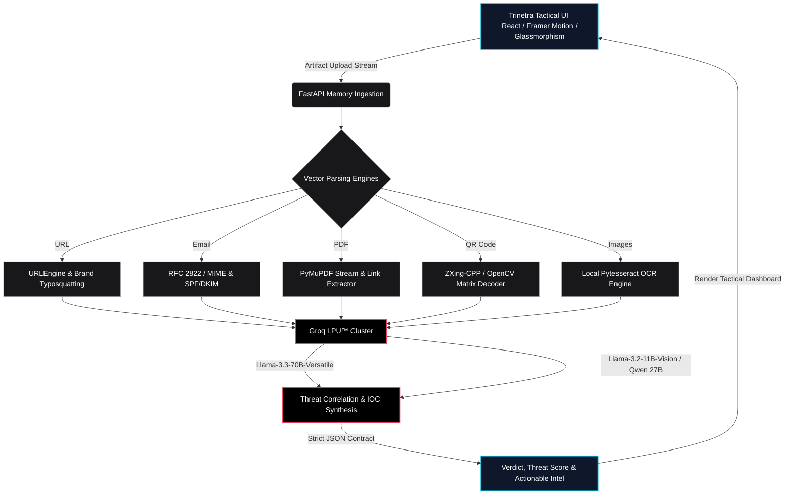

# TRINETRA

**Author**: Prasad Prashant Dabhekar (B.E. Information Technology)

## Project Overview
TRINETRA is an AI-powered digital artifact forensics platform designed to aid security analysts in inspecting and dissecting suspicious digital payloads. The system focuses on localized extraction and parsing of artifacts to minimize data exposure and API payload sizes before transmitting structured indicators to large language models for threat reasoning. 

> **Technical Deep-Dive & Architecture:** For comprehensive technical specifications, detailed diagrams covering high-level system architecture, data flow, AI pipelines, investigation lifecycle, and the security model, please consult [ARCHITECTURE.md](documents/ARCHITECTURE.md).

## Core Architecture
The platform utilizes a decoupled client-server architecture:
- **Frontend Client (Tactical Analyst OS)**: Built with React, Tailwind CSS, and Framer Motion. It implements an asynchronous state-machine UI featuring compound ambient glassmorphism, an interactive Cybernetic Third Eye HUD, and a 7-stage investigation progression orchestrator for robust file staging, upload handling, and threat report rendering.
- **Backend Service (Memory-Mapped Ingestion)**: Built on FastAPI. The backend orchestrates deterministic data extraction using vector-specific Python forensic libraries before querying the AI engine. Local parsing ensures that large binary streams and non-actionable data are stripped out in memory prior to LLM inference, preventing execution risks.
- **AI Engine (Groq LPU™ Inference)**: Utilizes the Groq Tensor Streaming Processor API for sub-second reasoning. Text and JSON IOC dictionaries are analyzed by Llama-3.3-70b-versatile, while vision tasks, synthetic media analysis, and QR logo fallback decoding are processed by Llama-3.2-11b-vision-preview and Qwen 3.6 27B.

## System Architecture

When digital artifact payloads are uploaded via the React frontend, the FastAPI server immediately directs them to specialized Python engines that perform localized deterministic parsing and preprocessing in memory. Once the raw noise and execution hazards are stripped away, cleanly structured indicators and text streams are securely routed into Groq's Llama-3 inference models to evaluate threat metrics and return a standardized JSON verdict.

## Key Features
- **URL Intelligence & Typosquatting Detection**: Extracts domains, TLD risk scores, redirect chains, and performs Levenshtein distance typosquatting checks against high-value brand indexes.
- **Email Forensics & Social Engineering Evaluation**: Parses `.eml` files to extract routing headers, verify SPF/DKIM/DMARC alignment, inspect attachments, and identify urgency-based linguistic manipulation.
- **PDF Stream Inspection & Link Unmasking**: Analyzes PDF structures directly in memory using PyMuPDF (`fitz`) to extract embedded hyperlinks, annotations, and invoice text while bypassing malicious JavaScript execution layers.
- **QR Code (Quishing) Analysis with Multi-Stage Pipeline**: Utilizes local OpenCV and `zxing-cpp` (with dark-mode bitwise-NOT matrix inversion), backed by a Groq Vision AI fallback (`Llama-3.2-11b-vision-preview`) for heavily stylized or logo-overlaid payment matrices (e.g., UPI/GPay codes). AI threat reasoning translates findings into accessible, non-technical guidance while recognizing benign transaction flows.
- **Screenshot Vision OCR & Synthetic Media Engine**: Extracts text locally via `pytesseract` and evaluates visual streams for AI-generated synthetic artifacts and deepfake markers prior to LLM threat synthesis.
- **Interactive Technical Documentation Hub**: Integrated within the system dossier (`SYSTEM.ABOUT`), featuring an interactive Bento grid where vectors expand into dark glass inspection drawers detailing technical stacks, threat metrics, and prompt strategies.
- **Defensive Error Handling (Early Return Protocol)**: Features proactive edge exception trapping that catches malformed or non-QR images and synthesizes safe schema-compliant fallback responses, eliminating UI hangs and HTTP server exceptions.

## Tech Stack
- **Frontend**: React, Tailwind CSS, Lucide Icons
- **Backend**: Python 3.10+, FastAPI, Uvicorn
- **Extraction Libraries**: `PyMuPDF` (fitz), `zxing-cpp`, `OpenCV` (cv2), `pytesseract`, native Python `email` module
- **AI Integration**: Groq API (Llama-3.3-70b-versatile, Llama-3.2-11b-vision-preview, Qwen 3.6 27B)

## Prerequisites
- Node.js (v18+)
- Python (3.10+)
- Tesseract OCR engine installed at the OS level
- Groq API Key

## Installation & Run Instructions

### Backend Setup
1. Navigate to the backend directory:
   ```bash
   cd backend
   ```
2. Create and activate a virtual environment (optional but recommended):
   ```bash
   python -m venv venv
   source venv/bin/activate  # Linux/macOS
   # or
   .\venv\Scripts\activate   # Windows
   ```
3. Install dependencies:
   ```bash
   pip install -r requirements.txt
   ```
   *(Ensure the system-level dependency for Tesseract OCR is installed prior to this step.)*
4. Configure environment variables by creating a `.env` file:
   ```
   GROQ_API_KEY=your_api_key_here
   ```
5. Run the FastAPI server:
   ```bash
   python -m uvicorn main:app --reload --env-file .env
   ```

### Frontend Setup
1. Navigate to the frontend directory:
   ```bash
   cd frontend
   ```
2. Install Node modules:
   ```bash
   npm install
   ```
3. Start the development server:
   ```bash
   npm run dev
   ```
