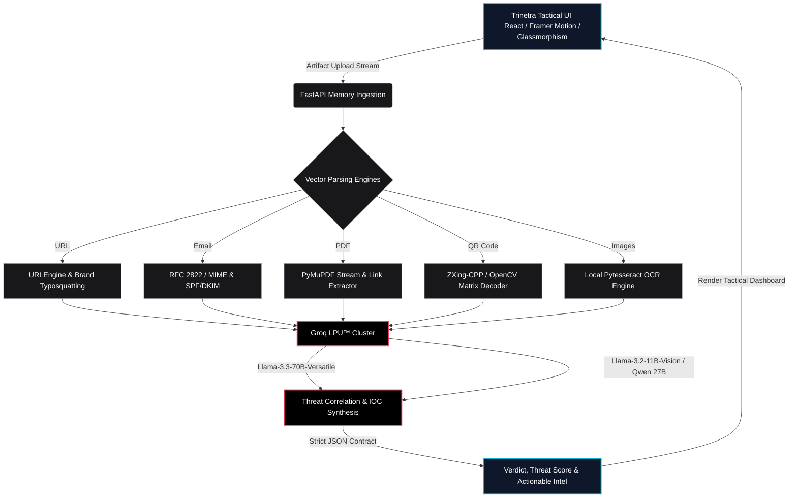

# TRINETRA

**Author**: Prasad Prashant Dabhekar (B.E. Information Technology)

## Project Overview
TRINETRA is an AI-powered digital artifact forensics platform designed to aid security analysts in inspecting and dissecting suspicious digital payloads. The system focuses on localized extraction and parsing of artifacts to minimize data exposure and API payload sizes before transmitting structured indicators to large language models for threat reasoning. 

> **Technical Deep-Dive & Architecture:** For comprehensive technical specifications, detailed diagrams covering high-level system architecture, data flow, AI pipelines, investigation lifecycle, and the security model, please consult [ARCHITECTURE.md](documents/ARCHITECTURE.md).

## Core Architecture
The platform utilizes a decoupled client-server architecture:
- **Frontend Client (Tactical Analyst Workbench)**: Built with React, Tailwind CSS, and Framer Motion. It implements an asynchronous state-machine UI featuring compound ambient glassmorphism, an interactive Cybernetic Third Eye HUD, a Holographic Dossier Reveal, and a 7-stage investigation progression orchestrator for robust file staging, upload handling, and threat report rendering.
- **Backend Service (Memory-Mapped Ingestion)**: Built on FastAPI. The backend orchestrates deterministic data extraction using vector-specific Python forensic libraries before querying the AI engine. Local parsing ensures that large binary streams and non-actionable data are stripped out in memory prior to LLM inference, preventing execution risks.
- **AI Engine (Groq LPU™ Inference)**: Utilizes the Groq Tensor Streaming Processor API for sub-second reasoning. Text and JSON IOC dictionaries are analyzed by Llama-3.3-70b-versatile, while vision tasks, synthetic media analysis, and QR logo fallback decoding are processed by Llama-3.2-11b-vision-preview and Qwen 3.6 27B.

## System Architecture

When digital artifact payloads are uploaded via the React frontend, the FastAPI server immediately directs them to specialized Python engines that perform localized deterministic parsing and preprocessing in memory. Once the raw noise and execution hazards are stripped away, cleanly structured indicators and text streams are securely routed into Groq's Llama-3 inference models to evaluate threat metrics and return a standardized JSON verdict.

## Key Features
- **URL Intelligence & Typosquatting Detection**: Extracts domains, TLD risk scores, redirect chains, and performs Levenshtein distance typosquatting checks against high-value brand indexes.
- **Email Forensics & Social Engineering Evaluation**: Parses `.eml` and Microsoft Outlook `.msg` files to extract routing headers, perform non-blocking threaded IP geolocation lookups (`run_in_threadpool`), verify SPF/DKIM/DMARC alignment, inspect all embedded and attached images (passing them simultaneously to Vision AI), and identify urgency-based linguistic manipulation.
- **Automated PII Masking (Data Privacy)**: A zero-trust local privacy interceptor that is permanently enforced by default. It proactively redacts sensitive Personally Identifiable Information (PII) such as Credit Card numbers (validated via the Luhn algorithm), Aadhaar numbers, and international mobile numbers from unstructured text (emails, OCR) locally before any data leaves the backend for AI inference, while strictly preserving crucial Indicators of Compromise (IOCs) like URLs, IPs, and email addresses.
- **PDF Stream Inspection & Link Unmasking**: Analyzes PDF structures directly in memory using PyMuPDF (`fitz`) to extract embedded hyperlinks, annotations, and invoice text while bypassing malicious JavaScript execution layers.
- **QR Code (Quishing) Analysis with Multi-Stage Pipeline**: Utilizes local OpenCV and `zxing-cpp` (with dark-mode bitwise-NOT matrix inversion), backed by a Groq Vision AI fallback (`llama-3.2-11b-vision-preview`) for heavily stylized or logo-overlaid payment matrices (e.g., UPI/GPay codes). AI threat reasoning translates findings into accessible, non-technical guidance while recognizing benign transaction flows.
- **Screenshot Vision OCR & Synthetic Media Engine**: Extracts text locally via threaded `pytesseract` and executes mathematical 2D Fast Fourier Transform (FFT) spectrum analysis in threadpools (`run_in_threadpool`) to keep the event loop non-blocking. Performs live keyless OSINT queries via DuckDuckGo with query truncation (first 15 words) and a resilient 5-second timeout wrapper, and evaluates visual streams using cryptographic C2PA manifests, EXIF metadata, and Error Level Analysis (ELA). Powered by a two-stage pipeline utilizing `llama-3.2-11b-vision-preview` for base64 visual decoding and `qwen/qwen3.8-27b` for text reasoning, governed by an enhanced 4-Step Forensic Audit capable of unmasking synthetic UI screenshots, monospace typography melting, and non-hex hash distortions that bypass standard pixel sensors.
- **Multilingual Threat Reporting**: Generates diagnostic reports, threat correlations, and executive summaries in multiple target languages via dynamic backend LLM prompt instruction, while maintaining a lean, high-performance English UI that seamlessly supports browser-level translation.
- **Dynamic AI Core Telemetry & Command Bridge**: Implements real-time network state tracking (`navigator.onLine`) with glowing emerald/rose status beacons and an integrated Command Bridge navbar that links analysts directly to system telemetry and engine specifications.
- **Unified Triad of Forensic Terminal Modals**: Architectural synchronization across `System About`, `Reasoning Groq`, and `Privacy Shield`. Built with deep glassmorphism (`bg-[#0a0f18]/95`, `backdrop-blur-2xl`, `border-cyan-500/30`, subtle inner glow), top-right `[ESC]` close triggers with global keyboard bindings, and semantic multi-colored accent palettes (Emerald, Purple, Amber, Rose, and Cyan) structured across terminal cards.
- **Interactive Technical Documentation Hub**: Integrated within the system dossier (`SYSTEM.ABOUT`), featuring an interactive Bento grid where vectors expand into dark glass inspection drawers detailing technical stacks, threat metrics, and prompt strategies.
- **Defensive Error Handling (Early Return Protocol)**: Features proactive edge exception trapping that catches malformed or non-QR images and synthesizes safe schema-compliant fallback responses, eliminating UI hangs and HTTP server exceptions.
- **API Security & Rate Limiting**: Implements SlowAPI rate limiting (6 requests/minute) and strict payload size restrictions (10MB limit) via custom FastAPI middleware to prevent DDoS vectors and ensure stable cloud AI inference.

## Tech Stack
- **Frontend**: React, Tailwind CSS, Lucide Icons
- **Backend**: Python 3.10+, FastAPI, Uvicorn
- **Extraction Libraries**: `PyMuPDF` (fitz), `zxing-cpp`, `OpenCV` (cv2), `pytesseract`, `c2pa-python`, `Pillow`, `duckduckgo-search`, `extract-msg`, native Python `email` module
- **AI Integration**: Groq API (Llama-3.3-70b-versatile, Llama-3.2-11b-vision-preview, Qwen 3.8 27B)

## Repository Structure & Module Architecture

```
TRINETRA/
├── backend/                              # Memory-mapped FastAPI forensic service
│   ├── ai/
│   │   └── reasoning.py                  # Groq LPU™ prompt orchestration & structured Pydantic extraction
│   ├── api/
│   │   └── investigate.py                # Consolidated multi-vector router (URL, Email, PDF, QR, Image)
│   ├── engines/
│   │   └── url_engine.py                 # Deterministic URL parser, Shannon entropy & typosquatting heuristics
│   ├── intelligence/
│   │   └── reputation.py                 # Threat heuristics calculator, domain age & brand risk scoring
│   ├── schemas/
│   │   ├── intelligence.py               # Pydantic schemas for input validation & domain telemetry
│   │   └── investigation.py              # Strict response contracts governing verdicts, scores & IOCs
│   ├── tests/
│   │   └── test_privacy_filter.py        # Unit tests for Luhn check, contact scrubbing & IOC preservation
│   ├── utils/
│   │   ├── __init__.py                   # Utility package initializer
│   │   └── privacy_filter.py             # Zero-trust deterministic PII mask (Cards, Phones, Aadhaar)
│   ├── .env                              # Local environment configuration & API secret management
│   ├── .env.example                      # Production deployment environment variable template
│   ├── Dockerfile                        # Production multi-stage build (Tesseract OCR, libgl1, Uvicorn)
│   ├── main.py                           # ASGI app entrypoint, CORS, 10MB upload guard & SlowAPI rate limiter
│   ├── requirements.txt                  # Pinned production dependencies for deterministic environments
│   ├── test_main.py                      # Integration test suite validating health & route availability
│   └── utils.py                          # File hashing, byte stream normalization & cross-vector utilities
│
├── frontend/                             # React 18 + Tailwind CSS tactical analyst console
│   ├── public/
│   │   └── favicon.svg                   # Vector Third Eye aperture emblem for browser navigation
│   ├── src/
│   │   ├── components/
│   │   │   ├── AboutHologram.jsx         # System dossier modal with 5-vector Bento grid & deep-dive drawers
│   │   │   ├── AIAssistantEye.jsx        # Cybernetic Third Eye HUD with pupil tracking & reactive status ringsdi
│   │   │   ├── AiCoreStatus.jsx          # Live network telemetry beacon monitoring client connectivity
│   │   │   ├── AIInvestigationResult.jsx # Holographic threat dossier rendering verdicts, scores & evidence
│   │   │   ├── CinematicSplash.jsx       # 3-second mecha-iris boot sequence with system diagnostic telemetry
│   │   │   ├── EmailWorkspace.jsx        # RFC 2822 / Outlook .msg parser inspecting hops & embedded assets
│   │   │   ├── ImageWorkspace.jsx        # Screenshot forensic canvas running OCR, OSINT & synthetic deepfake audits
│   │   │   ├── InvestigationWorkspace.jsx# Primary 5-vector workspace navigator with drag-and-drop staging
│   │   │   ├── LivingDashboard.jsx       # Command bridge header and main viewport layout orchestrator
│   │   │   ├── NetworkNodes.jsx          # Ambient canvas particle mesh rendering cybernetic background connections
│   │   │   ├── PdfWorkspace.jsx          # Sandboxed PDF stream analyzer unmasking links & hidden image layers
│   │   │   ├── PrivacyShieldModal.jsx    # Interactive terminal modal explaining zero-trust PII masking engines
│   │   │   ├── QrWorkspace.jsx           # Quishing decoder with inverted matrix reading & Vision AI fallback
│   │   │   └── ReasoningGroqModal.jsx    # Hardware specs overlay detailing Groq LPU™ benchmarks & ZDR policy
│   │   ├── config/
│   │   │   └── api.js                    # Centralized dynamic API endpoint resolver (VITE_API_URL / localhost)
│   │   ├── App.jsx                       # Top-level state machine orchestrator managing launch transitions
│   │   ├── index.css                     # Global design tokens, tactical glassmorphism styles & custom keyframes
│   │   └── main.jsx                      # Application entrypoint mounting React tree into DOM
│   ├── .env.example                      # Frontend cloud deployment environment variable template
│   ├── .oxlintrc.json                    # High-performance Rust-based linter configuration
│   ├── index.html                        # HTML5 shell configured with Inter and JetBrains Mono typography
│   ├── package.json                      # Frontend package manifest, dependencies & build scripts
│   ├── package-lock.json                 # Deterministic dependency lockfile ensuring reproducible builds
│   ├── vercel.json                       # Zero-config SPA client-side route rewrites for cloud edge hosting
│   └── vite.config.js                    # Vite build configuration with React & Tailwind CSS plugins
│
├── documents/                            # Comprehensive enterprise documentation suite
│   ├── API_DOCS.md                       # OpenAPI route documentation, payload specifications & response schemas
│   ├── ARCHITECTURE.md                   # Deep-dive engineering whitepaper on memory safety & threat models
│   ├── DEV_LOGS.md                       # Chronological milestone changelog tracking all development phases
│   ├── LIMITATIONS.md                    # Transparent audit of architectural boundaries & engine constraints
│   ├── SECURITY.md                       # Security disclosure guidelines, threat mitigation & PII policies
│   ├── SRS.md                            # Software Requirements Specification covering functional/non-functional specs
│   └── TACTICAL_PLAYBOOK.md              # Standard Operating Procedures (SOP) for SOC incident response teams
│
├── .gitignore                            # Production exclusions for build caches, bytecode & local env files
├── .windsurfrules                        # Architectural constraints and development operational rules
└── LICENSE                               # MIT License governing open-source use, modification & attribution
```

## Prerequisites
- Node.js (v18+)
- Python (3.10+)
- Tesseract OCR engine installed at the OS level
- Groq API Key

## Installation & Run Instructions

### Backend Setup
1. Navigate to the backend directory:
   ```bash
   cd backend
   ```
2. Create and activate a virtual environment (optional but recommended):
   ```bash
   python -m venv venv
   source venv/bin/activate  # Linux/macOS
   # or
   .\venv\Scripts\activate   # Windows
   ```
3. Install dependencies:
   ```bash
   pip install -r requirements.txt
   ```
   *(Ensure the system-level dependency for Tesseract OCR is installed prior to this step.)*
4. Configure environment variables by creating a `.env` file (see `.env.example`):
   ```env
   GROQ_API_KEY=your_api_key_here
   ENVIRONMENT=development  # Set to 'production' to enable IP rate limiting
   ```
5. Run the FastAPI server:
   ```bash
   python -m uvicorn main:app --reload --env-file .env
   ```

### Frontend Setup
1. Navigate to the frontend directory:
   ```bash
   cd frontend
   ```
2. Install Node modules:
   ```bash
   npm install
   ```
3. Start the development server:
   ```bash
   npm run dev
   ```

## Production Deployment

TRINETRA is fully containerized and optimized for edge deployment, separating the tactical React frontend from the high-throughput FastAPI execution layer.

### Frontend Deployment (Vercel / Netlify / Cloudflare Pages)
The presentation layer is built with Vite and React, making it ideal for edge CDN distribution.
1. Connect your repository to Vercel and set the **Root Directory** to `frontend`.
2. Vercel automatically detects Vite with build command `npm run build` and output directory `dist`.
3. Configure the environment variable in your Vercel Project Settings:
   - `VITE_API_URL`: URL of your deployed backend (e.g., `https://trinetra-api.up.railway.app`).
4. The included `vercel.json` ensures zero-config client-side routing rewrites.

### Backend Deployment (Railway / Render via Docker)
The application layer is fully containerized to guarantee identical execution across all cloud platforms.
1. Connect your repository to Railway or Render and set the **Root Directory** to `backend`.
2. The platform automatically detects `Dockerfile`, builds the Linux image with system packages (`tesseract-ocr`, `libgl1`, `libglib2.0-0`), and boots the 4-worker Uvicorn cluster on the injected `$PORT`.
3. Set environment variables in your cloud dashboard:
   - `GROQ_API_KEY`: Your Groq LPU™ API key.
   - `ENVIRONMENT`: Set to `production` to activate SlowAPI rate-limiting (6 requests/min).
   - `ALLOWED_ORIGINS`: (Optional) Comma-separated list of additional frontend domains (e.g., `https://your-custom-domain.com`). Automatic regex allows all `*.vercel.app` domains out of the box.

## Attribution

TRINETRA is an original cybersecurity project developed by **Prasad Prashant Dabhekar**.

This project is released under the MIT License. You are free to use, modify,
and distribute the software in accordance with the license terms.

If you use substantial portions of the TRINETRA source code or build a
derivative project based on TRINETRA, please provide clear attribution to
the original project and author:

> TRINETRA — developed by Prasad Prashant Dabhekar

Please retain the original copyright and license notices when redistributing
substantial portions of the source code.

**GitHub Repository**: [https://github.com/prasad-sec/TRINETRA](https://github.com/prasad-sec/TRINETRA)
