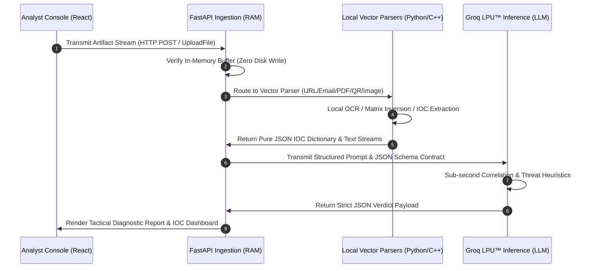

# TRINETRA Platform Architecture & Technical Deep-Dive

**Project:** TRINETRA — Digital Forensics & Threat Detection Architecture  
**Author:** Prasad Prashant Dabhekar  

---

## 1. High-Level System Architecture & Executive Summary

TRINETRA is engineered as an **AI Digital Forensics Platform**—a unified, high-performance command tool designed to empower security analysts and incident responders with advanced, deterministic threat triage. Unlike traditional monolithic scanners that transmit unprocessed payload files across internet networks to remote APIs, TRINETRA enforces a strict, decoupled edge-to-intelligence pipeline.

```
       [ PRESENTATION LAYER ]            [ APPLICATION & EDGE LAYER ]          [ INTELLIGENCE LAYER ]
   ┌─────────────────────────────┐    ┌─────────────────────────────────┐    ┌─────────────────────────┐
   │    Trinetra Analyst UI      │    │    FastAPI Memory Ingestion     │    │   Groq LPU™ Clusters    │
   │  React 18 / Tailwind / MVVM │───>│   Vector Deterministic Parsers  │───>│  Llama-3.3-70B / 11B    │
   │   State-Machine Console     │<───│  Strict Schema JSON Middleware  │<───>│   Qwen 3.6 27B Vision   │
   └─────────────────────────────┘    └─────────────────────────────────┘    └─────────────────────────┘
```

By running automated, localized parsing and binary stream disinfection across five heterogeneous threat vectors—URLs, Emails, PDFs, QR Codes (Quishing), and Vision Screenshots—the operating system extracts pure, high-signal Indicators of Compromise (IoCs) and syntactic threat features directly in memory. These refined artifacts are subsequently streamed into ultra-low-latency large language model (LLM) inference clusters to perform contextual threat correlation, linguistic social-engineering discovery, and automated forensic reasoning. The resulting output bridges the gap between deep structural cryptanalysis and intuitive, actionable cybersecurity intelligence.

---

## 2. Data Flow & Execution Pipeline

The execution flow of TRINETRA is structurally designed to guarantee data minimization, sub-second execution speeds, and complete isolation between untrusted binary payloads and external model evaluation. The pipeline progresses through five rigorous phases:



1. **Staging & Ingestion:** The analyst drops an artifact into the React state-machine workspace. The client packages the input (raw URL strings or binary stream chunks) and initiates an asynchronous POST transmission to the designated FastAPI vector route.
2. **In-Memory Buffer Validation:** The FastAPI server traps the incoming stream directly within random-access memory (RAM). No disk write operations are allowed, nullifying risk from local shell execution or filesystem traversing payloads.
3. **Deterministic Feature Extraction:** Specialized Python and C++ engine bindings (`PyMuPDF`, `zxing-cpp`, `OpenCV`, `pytesseract`) disassemble the digital artifact locally. Embedded formatting noise, binary code layers, and redundant imagery are discarded. Only purified syntactic Indicators of Compromise (IoCs)—such as routing relay paths, extracted URLs, decoded matrices, and OCR text streams—are structured into an in-memory dictionary.
4. **LPU™ Tensor Streaming Inference:** The backend formats the purified IOC dictionary against vector-specific system instructions and transmits a compact payload to Groq's high-speed Tensor Streaming Processor infrastructure.
5. **Schema-Bound Dashboard Rendering:** The inference engine enforces a rigid JSON contract response. The backend relays this structured verdict directly to the React frontend, triggering an immediate UI transition from active investigation telemetry to an interactive tactical report dashboard.

---

## 3. Frontend Architecture (The Tactical Analyst Console)

The presentation layer of TRINETRA rejects generic, commercial web design conventions in favor of a specialized **Analyst Console** design philosophy. Engineered for zero-friction operation in high-stress SOC (Security Operations Center) environments, the frontend balances aesthetic superiority with absolute structural clarity.

### 3.1 Core Technologies & Visual Framework
- **React 18 & State Machine UI:** Built on a strict asynchronous UI state machine (`idle`, `staging`, `investigating`, `reasoning`, `completed`, `error`). This ensures deterministic transitions during file drop events, stream execution, and diagnostic visualization, eliminating race conditions or inconsistent UI states during concurrent investigation flows.
- **Tailwind CSS (Analyst Console Design System):** Employs an **absolute dark mode** (`bg-zinc-950`), sharp geometric layouts, and **tactical glassmorphism** (`bg-zinc-950/70` with `backdrop-blur-md`, `border-cyan-500/20`, and `rounded-xl` corners). High-contrast **strict monospace typography** (utilizing tracking-wide letterforms for telemetry logs, hashes, and network headers) prevents misidentification of homoglyphs and malicious URLs.
- **Framer Motion & Animation Kinetics:** Hardware-accelerated animations are integrated not as aesthetic embellishment, but as cognitive state feedback. Key kinetic installations include:
  - **The Cybernetic Third Eye HUD:** A custom-engineered scalable vector graphics (SVG) assembly featuring counter-rotating concentric astrolabe rings and an animated Mecha-Iris aperture that scales open during initial diagnostic synchronization.
  - **Interactive Technical Documentation Hub:** Within the system dossier (`SYSTEM.ABOUT`), an unmounting bento grid transitions seamlessly into an expanding dark-glass inspection drawer via layout-id morphing and `AnimatePresence` state retention.
  - **Holographic Dossier Reveal:** The Digital Investigation Report view cascades into visibility using custom CSS keyframes (`dossierReveal`) with staggered 3D transform delays (`perspective`, `rotateX`), creating a holographic entrance effect.
  - **Visual Telemetry:** Pulsing neon status radar emitters (`animate-ping`) and staggered kinetic entrances provide immediate visual affirmation of engine execution states.

---

## 4. Backend Architecture & Vector Parsing Engines

The application layer is powered by a **FastAPI** service engineered for non-blocking asynchronous request handling and entirely memory-mapped stream processing. To neutralize execution risks from malicious binaries (e.g., weaponized PDFs or exploit payloads), uploaded streams are digested via distinct, highly specialized Python parsing engines prior to LLM submission.

```
[ Ingested Binary Stream ] ────> [ Local Memory Validation ] ────> [ Deterministic Feature Extraction ] ────> [ Pure JSON IoC Payload ]
```

### 4.1 Vector-Specific Parsing Engines
1. **URL Intelligence (`/api/investigate/url`):**
   - **Engine:** Custom Python `URLEngine` utilizing `tldextract`, `validators`, and native `ipaddress` heuristics.
   - **Feature Extraction:** Deconstructs complete Uniform Resource Identifiers to evaluate top-level domain (TLD) risk scores, domain creation age heuristics, IP-literal routing, suspicious parameter permutations, open-redirect chains, and Levenshtein distance typosquatting against high-value financial brand indexes.
2. **Email Forensics (`/api/investigate/email`):**
   - **Engine:** Native Python `email` (RFC 2822), `extract-msg` for Microsoft Outlook `.msg` files, and MIME structure traversal parsers paired with attachment extraction pipelines.
   - **Feature Extraction:** Dissects routing header chains to verify authentication alignment (SPF, DKIM, DMARC), extracts IP relay paths, and detects Return-Path vs. From header spoofing. Simultaneously decodes MIME multipart and `.msg` bodies (bypassing container wrappers) to scan for linguistic urgency markers and implements a Deployment-Safe Recursive Artifact Bridge that extracts all embedded and attached images (up to 5), downsamples them for memory safety, routes them through mathematical vision sensors (FFT/ELA), and passes them simultaneously to the Vision LLM to detect concealed AI payloads.
3. **PDF Document Inspector (`/api/investigate/pdf`):**
   - **Engine:** `PyMuPDF` (`fitz`) stream extractor paired with local pattern-matching regex engines.
   - **Feature Extraction:** Reads PDF binary structures directly in RAM without launching external reader execution wrappers or executing embedded JavaScript engines. Extracts embedded annotations and URIs, and utilizes the Recursive Artifact Bridge to parse and recursively analyze embedded images for hidden quishing or deepfake threats without exceeding cloud server RAM constraints.
4. **QR Code Quishing Decoder (`/api/investigate/qr`):**
   - **Engine:** Multi-stage computer vision pipeline leveraging `OpenCV` (`cv2`) and high-performance C++ bindings via `zxing-cpp`.
   - **Feature Extraction:** Stage 1 applies local image resizing, thresholding, and **bitwise-NOT matrix inversion** to reliably recover dark-mode or low-contrast barcodes. Extracts Virtual Payment Address (VPA) syntax, UPI payment parameter anomalies (`pa`, `pn`, `am`), embedded redirect shorteners, and obfuscated phishing URIs. Stage 2 triggers an intelligent vision fallback for artistic or logo-overlaid payment matrices.
5. **Vision & Synthetic Image Engine (`/api/investigate/image`):**
   - **Engine:** Local Optical Character Recognition (OCR) via `pytesseract`, live OSINT via `duckduckgo-search`, cryptographic metadata parsing (`c2pa-python`), EXIF extraction (`Pillow`), Error Level Analysis (ELA) generation, and 2D Fast Fourier Transform (FFT) spectrum analysis (`numpy`).
   - **Feature Extraction:** Pre-processes image streams locally to extract dense textual indicators (e.g., within screenshot conversations or fraudulent transaction proofs). Feeds OCR output into a Keyless DuckDuckGo OSINT Pipeline (duckduckgo-search) to fetch live web context without hitting external API rate limits or requiring paid API keys, ensuring highly scalable deployment. Extracts C2PA active manifests, filters EXIF camera metadata, computes ELA scores, and evaluates 2D FFT high-frequency ratios to detect diffusion upsampling residual artifacts (synthetic media). Filters raw image noise locally before routing visual OSINT context and extracted text to vision models for synthetic generative artifact analysis and threat classification via a mandatory 4-Step Forensic Audit.

---

## 5. AI Threat Pipeline (Inference & Schema Enforcement)

The intelligence layer decouples complex syntactic feature data from computational evaluation by routing pre-processed JSON structures directly into high-speed inference engines hosted on the **Groq Tensor Streaming Processor (LPU™)** infrastructure. This guarantees sub-second reasoning even when executing deep contextual heuristics across dense threat payloads.

### 5.1 Model Roles & Specialization
- **Primary Reasoning Model (`Llama-3.3-70B-Versatile`):** Assigned to text, network telemetry, header evaluation, and structural code analysis. It correlates extracted IoCs against deceptive framing mechanics and financial fraud archetypes, synthesizing multi-vector evidence into an objective threat score (0–100) and an executive summary formatted in clear, professional terminology.
- **Vision & Synthetic Media Engine (`Llama-3.2-11B-Vision-Preview` & `Qwen-3.6-27B`):** Activated for direct RGB tensor evaluation during image investigations and Stage-2 QR visual fallback decodes. Analyzes lighting geometry, font kerning inconsistencies, interface forgery markers, and adversarial QR logo manipulations that elude standard algorithmic barcode readers.

### 5.2 Deterministic Output Enforcement via Strict JSON Schemas
To eliminate hallucinations and ensure programmatic stability within the React UI state machine, all AI Engine invocations are governed by strict schema instruction injection and structural response enforcement. Every inference response must conform identically to the platform contract:
```json
{
  "verdict": "SAFE | SUSPICIOUS | MALICIOUS",
  "threat_score": 0,
  "confidence": 100,
  "executive_summary": "High-level summary of analysis results.",
  "ai_reasoning": "Detailed technical explanation of evaluated threat indicators.",
  "evidence_collected": {
    "indicators": ["Key threat indicator 1", "Key threat indicator 2"]
  }
}
```

### 5.3 Multilingual Threat Reporting
To support global SOC teams, the intelligence layer dynamically ingests a `target_language` parameter from the UI orchestrator. This instruction is injected into the primary reasoning prompt, forcing the LLM to output the `executive_summary` and `ai_reasoning` fields in the user's preferred language while preserving the English definitions of technical IoCs and maintaining the exact JSON schema structure. This backend-driven approach keeps the frontend lean and high-performance by bypassing heavy client-side localization libraries.

---

## 6. Investigation Lifecycle & Pipeline Orchestration

When an analyst initiates a digital artifact inspection, the frontend (`InvestigationWorkspace.jsx`) activates a synchronized real-time execution lifecycle. To prevent visual flickering from instantaneous sub-second LPU responses and to provide complete visibility into the automated forensic mechanics, the system employs an automated **7-Stage Pipeline Orchestrator**.

### 6.1 Real-Time Telemetry Progression
During active triage (`investigating` and `reasoning` states), the UI iterates across seven discrete analytical milestones:
1. **Artifact Received:** Immediate binary byte or URI parameter capture and state machine activation.
2. **Normalizing Data:** In-memory validation, character encoding normalization, and stream sanitation.
3. **Extracting Indicators:** Local deterministic parsing (RFC 2822 header unpacking, PyMuPDF stream stripping, bitwise matrix inversion, OCR extraction).
4. **Threat Intelligence Correlation:** Typosquatting Levenshtein indexing and heuristic anomaly correlation.
5. **Behavior Analysis:** Linguistic urgency markers, redirection logic loops, and parameter anomaly identification.
6. **AI Reasoning:** Groq LPU™ tensor stream evaluation across Llama-3 clusters and prompt reasoning synthesis.
7. **Investigation Report Generated:** Structural schema verification and dashboard unmasking.

### 6.2 Timing Synchronization Logic
The pipeline orchestrator utilizes a synchronized timing lock (`investigationStartTime` paired with a minimum elapsed duration threshold of 1200ms). When backend completion signaling (`backendCompleted`) fires before the UI progression concludes, the orchestrator smoothly accelerates through remaining diagnostic milestones before rendering the complete threat report. This guarantees an immersive, professional incident response UX that maintains absolute transparency over underlying system transitions.

---

## 7. Security Model & Defensive Engineering

An operational forensic console must remain impervious to zero-day payload execution, data exfiltration, and adversarial fuzzing. TRINETRA implements a multi-layered defensive security architecture across edge endpoints and presentation state machines.

### 7.1 Zero-Disk Execution & In-Memory Stream Disinfection
Traditional forensic workstations are susceptible to exploit payloads (such as embedded JavaScript execution within PDF readers or macro triggers in email attachments) when staging untrusted files on persistent local storage. TRINETRA eliminates this vulnerability through **Zero-Disk Ingestion**:
- Uploaded binary payloads are processed strictly within memory-mapped byte structures (`UploadFile` streams).
- Local extraction engines (`PyMuPDF`, `pytesseract`, `email`) read syntax directly from memory buffers without generating scratch files, temporary caches, or invoking external OS execution wrappers.
- Once indicator extraction completes, raw binary payload streams are discarded from volatile memory before external network requests initiate.

### 7.2 Privacy Optimization & Data Minimization
By enforcing local deterministic extraction prior to cloud inference, TRINETRA acts as a natural data minimizer and privacy shield:
- Massive raw binary files (such as high-resolution images or lengthy multi-page PDF documents) are stripped of non-actionable byte noise locally.
- **Permanent Local PII Masking:** Extracted unstructured text (email bodies, PDF text, OCR readouts) is strictly routed through a permanent zero-trust privacy filter (`privacy_filter.py`). This interceptor uses Luhn algorithms and negative lookaround boundaries to locally redact Credit Cards, Aadhaar numbers, and phone numbers *before* the data leaves the backend for AI inference. This architectural guarantee actively prevents the accidental transmission of PII to cloud LLMs, while explicitly preserving URLs, IP addresses, and email headers.
- Only purified textual Indicators of Compromise, routing headers, and sanitized text streams are transmitted to Groq inference endpoints, slashing network bandwidth consumption and safeguarding sensitive organizational proprietary documents and individual PII from external transmission.

### 7.3 Prompt Injection & Hallucination Defenses
Because suspicious emails and documents often embed adversarial prompt instructions designed to hijack AI classification, TRINETRA isolates extracted strings inside strict structural schemas. The system instructions define unambiguous role guardrails that instruct Llama-3 models to treat all ingested payload parameters strictly as data targets for threat evaluation, neutralizing attempts at context overriding or verdict manipulation.

### 7.4 The Early Return Protocol for Irrelevant & Unreadable Payloads
In legacy security scanning applications, submitting an unsupported or unintelligible artifact (such as uploading a blank image or a photograph without a valid QR barcode to the QR analyzer) regularly results in backend unhandled exceptions (HTTP 400/500 errors), hanging API threads, or infinite loading loops in the user client. 

TRINETRA supersedes this via proactive edge logic:
1. **Graceful Matrix Catch (`investigate_qr_endpoint`):** When the OpenCV/ZXing-CPP engine and Vision AI fallback are unable to locate a valid QR matrix within an ingested image, the backend intercepts the decoding exception rather than returning an HTTP error code.
2. **Deterministic Safe Fallback:** The backend synthesizes a completely valid, structurally schema-compliant JSON response payload:
   ```json
   {
     "verdict": "SAFE",
     "threat_score": 0,
     "confidence": 100,
     "executive_summary": "No valid QR code was detected in the uploaded image.",
     "ai_reasoning": "The image stream was analyzed via standard optical matrix decoding and visual fallback pipelines. No machine-readable barcode or malicious quishing vector is present.",
     "evidence_collected": {
       "status": "Null QR Matrix",
       "indicators": ["No QR matrix located in payload"]
     }
   }
   ```
3. **Frontend UI Recovery Guarantee:** On the presentation layer (`QrWorkspace.jsx` and related inspection consoles), execution blocks (`try / catch / finally`) ensure that loading state triggers (`isLoading`, `setIsInvestigating`) are systematically reset to `false` regardless of network transmission interruptions or anomalies. This guarantees that the analyst interface never hangs, allowing immediate submission of subsequent artifacts without requiring manual application reloads.

### 7.5 API Rate Limiting & Payload Size Restrictions
To protect the backend from volumetric DDoS attacks and exhaustion of cloud AI inference quotas, TRINETRA enforces strict edge rate limiting:
- **SlowAPI Rate Limiting:** All 5 investigation endpoints are strictly throttled to 6 requests per minute per IP address. When exceeded, the system gracefully returns a standard `429 Too Many Requests` response.
- **Payload Size Restrictions:** A lightweight Starlette HTTP middleware intercepts incoming requests and measures `content-length` prior to loading streams into memory, enforcing a hard 10MB file limit to prevent Out-Of-Memory (OOM) faults during heavy PDF or Image ingestions.

---

## 8. Local Hardware & Validation Benchmarks

To verify efficiency, local deterministic parsing engines and memory-mapped validation loops have been benchmarked and verified on standard workstation hardware configurations (**AMD Ryzen 7 7445HS / NVIDIA RTX 3050 6GB / 16GB RAM**). By executing computationally expensive tasks (such as PDF OCR extraction and matrix inversion) on local CPU/GPU threads before reaching the Groq LPU™ infrastructure, TRINETRA maintains minimal bandwidth footprint and optimizes AI model context window efficiency across demanding threat hunting workflows.
